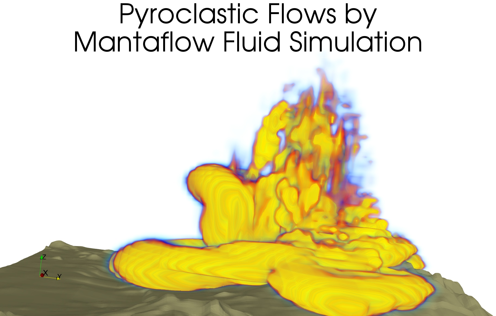

# MantaFlow-ParaView

Python wrappers to load ParaView DEM output (.obj) in MantaFlow and to save MantaFlow output in ParaView format (.vtk)

## MantaFlow Installation

### MacOS HomeBrew with Python 3.7 and GCC 10

Note: MacOS Clang doesn't support OpenMP and so GCC 10 is required for multicore processing.

```
git clone https://bitbucket.org/mantaflow/manta.git
mkdir manta/build
cd manta/build
cmake .. -DOPENMP=ON -DPYTHON_VERSION='3.7' -DNUMPY='ON' \
  -D CMAKE_C_COMPILER=/usr/local/bin/gcc-10 \
  -D CMAKE_CXX_COMPILER=/usr/local/bin/g++-10
make -j8
```

### Linux Ubuntu 18.04 with Python 3.6

```
apt-get update
apt-get -y install python3 python3-pip cmake
pip3 install --upgrade numpy matplotlib

ssh-keyscan bitbucket.org >> ~/.ssh/known_hosts
git clone https://bitbucket.org/mantaflow/manta.git
mkdir manta/build
cd manta/build
cmake .. -DOPENMP=ON -DPYTHON_VERSION='3.6' -DNUMPY='ON'
make -j8
```


# Examples



